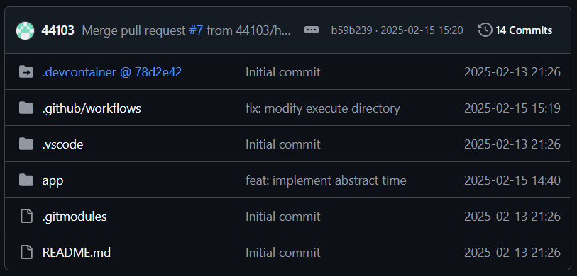

# Enhance GitHub Timestamps

GitHub displays relative times by default.  
Options other than the default display method are provided as shown below.

## How To Install

1. Open [Releases](https://github.com/44103/github-datetime-formatter/releases) page and download Chrome Extension file
2. Open [Chrome Extensions](chrome://extensions/) page and import this extension.
