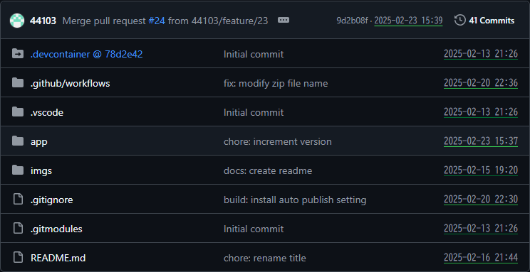
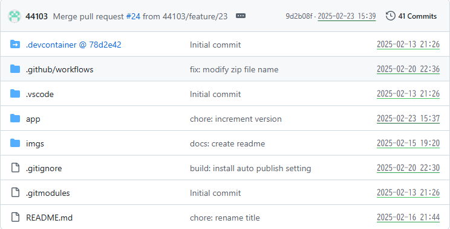

# Enhance GitHub Timestamps

This Chrome extension transforms relative timestamps on GitHub (e.g., "2 months ago") into absolute timestamps (e.g., "2025-02-10 12:34") for improved clarity.

Key Features

- Absolute Timestamps: Converts relative time references to precise date and time for commits, pull requests, and other events.
- Visual Highlighting: Adds colored underlines to new timestamps, making them easily distinguishable.
- Customizable Formats: (Planned) Offers multiple date and time formats to suit your preferences.
- Timezone Selection: Choose between local time and UTC for displaying absolute timestamps.

Benefits

- Improved Clarity: Quickly grasp the exact timing of events without mental calculations.
- Enhanced Context: Gain a clearer understanding of project history and activity.
- Personalized Experience: (Planned) Tailor the timestamp format to your needs.

Stay Tuned

More features are on the way, including customizable timestamp formats!

## How To Install

### Chrome Web Store

Please download from [Chrome Web Store](https://chromewebstore.google.com/detail/enhance-github-timestamps/jpfkamffgggihjpgijeolhhmhjglcabd).

### GitHub

1. Open [Releases](https://github.com/44103/github-datetime-formatter/releases) page and download Chrome Extension file
2. Open [Chrome Extensions](chrome://extensions/) page and import this extension.
